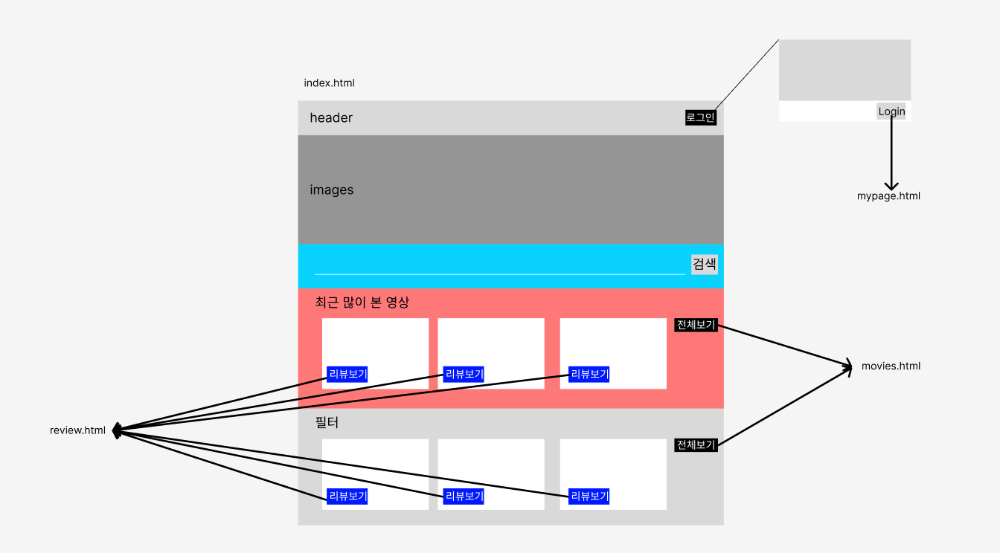

# PJT 2차 요약

## 개요

작성자 : 서울 7반 김태운
날짜 : 2023년 8월 11일
환경 : Windows 10 Enterprise
개발도구 : Visual Studio Code, Google Chrome
사용 프레임워크 : Bootstrap

<br>

**프로젝트 요구사항**

- 메인페이지, 리뷰페이지 구성
- (추가)회원가입, 로그인 화면

<br>

**프로젝트 목표**

- html, css, javascript를 이용한 간단한 홈페이지 작성
- 화면 구성 및 구현
- Bootstrap 프레임워크를 이용해보기.

<br>

**전체 구조**
- 메인 페이지는 index.html
- 화면 상단에 nav bar 존재
- 화면 중앙에 헬스장 사진과 키워드 검색 상자 존재.
- 화면 하단에 동영상 리스트 존재.(가장 많이 본 영상, 운동 부위 선택)
- 리뷰보기를 누르면 review.html로 이동
- 로그인버튼을 누른 후 나오는 모달 폼에서 로그인 버튼을 누르면 mypage.html로 이동
- 전체보기 버튼을 누르면 movies.html로 이동
- 
  
<br>

## 상세 내용
### 담당 파트
- 저는 이번 프로젝트에서 메인화면과 회원가입, 로그인 모달 구현을 맡았습니다.

### index.html
- 이 파일에는 메인 화면 구현을 하였습니다.
- 기본적으로 4개의 영상 화면을 card를 통해 구현해서 보이도록 하였고, 전체 영상을 보고 싶으면 전체보기 버튼을 누르면 mypage.html로 이동하도록 만들어 전체 영상을 볼 수 있도록 만들었습니다.
- 운동 부위 선택의 경우 필터 기능을 구현하기 위해 javascript를 이용하였습니다. 다음은 대표적인 코드의 일부를 불러왔습니다. main.js에 있습니다.
```javascript
//filter button 입력
  let btn1 = document.querySelector("#btncheck1");
  btn1.addEventListener('click', function(event){
    videoHtml = "";
    videoList.forEach((video)=>{
      if(video.part === "전신"){
        videoHtml += `
            <div class="card" style="width: 18rem;">
            <iframe width="286" height="190" src="https://www.youtube.com/embed/${video.id}" title="YouTube video player" frameborder="0" allow="accelerometer; autoplay; clipboard-write; encrypted-media; gyroscope; picture-in-picture; web-share" allowfullscreen></iframe>
            <div class="card-body">
              <h5 class="card-title">${video.title}</h5>
              <p class="card-text">${video.channelName}<span class="badge text-bg-primary">${video.part}</span></p>
              <a href="review.html" class="btn btn-primary">리뷰보기</a>
            </div>
        </div>
            `
      }
    })
    document.querySelector("#filter_container").innerHTML = videoHtml;
  });
```
- 우선 videoList를 객체 배열로 붙여넣고 진행하였습니다. 버튼이 클릭되면, videoHtml을 초기화하고, 모든 videoList 객체 배열 속 원소에 대해 part라는 속성이 검색하고자 하는 필터 내용과 일치할 경우, 이에 해당하는 html 코드를 추가하였습니다.
- 그 후, 해당 내용을 innerHTML attribute를 수정하는 방식을 통해 필요한 부분에 붙여넣었습니다.
- 이러한 방법을 통해 필터에 해당하는 기능을 구현할 수 있었습니다.
<br>

- 상단을 보면 여러 버튼이 있는데, 회원가입 버튼을 누르면 모달 폼이 나옵니다.
- 이 모달 폼에는 이메일 주소, 닉네임, 비밀번호, 비밀번호 확인을 입력하게 하였습니다.
- 비밀번호, 비밀번호 확인에 기능을 추가했습니다.
- 
```javascript
  //password 확인
  let regist_pw = document.querySelector("#inputPassword");
  regist_pw.addEventListener('keyup', function(event){
    let p1 = regist_pw.value;
    let msgbox = document.querySelector("#passwordHelpBlock");
    if(p1.length < 8){
      msgbox.innerText = "8자 이상으로 입력해 주세요."
    } else if(p1.length > 20){
      msgbox.innerText = "20자 이내로 입력해 주세요."
    } else{
      msgbox.innerText = "적절합니다."
    }
  });
```
- 비밀번호의 경우, 키를 눌렀다 떼는 순간 event가 작동하도록 하였습니다. 비밀번호 입력란에 입력된 문자의 개수를 파악해, 만약 8자보다 작거나 20자보다 많으면 수정이 필요하다는 메시지를 아래에 innerText형식으로 수정해서 띄우고, 그 외에는 적절하다는 메시지를 띄웠습니다.
- 비밀번호 확인
- 
```javascript
  let certify_pw = document.querySelector("#certifypw");
  certify_pw.addEventListener('keyup', function(event){
    let p1 = regist_pw.value;
    let p2 = certify_pw.value;
    let msgbox = document.querySelector("#passwordCheck");
    if(p1 === p2){
      msgbox.innerText = "일치합니다."
    } else{
      msgbox.innerText = "불일치합니다."
    }
  });

```
비밀번호란에 적힌 내용과 비밀번호 확인란에 적힌 내용을 비교해 둘이 일치할 경우 일치합니다.를 띄우도록 하였습니다.

<br>
- 로그인 버튼을 누르면 로그인 모달이 뜹니다. 여기서 로그인을 누르면 mypage.html로 이동합니다.

### movies.html
- 
```javascript
let videoHtml = "";

  videoList.forEach((video) => {
    videoHtml += `
    <div class="card" style="width: 18rem;">
    <iframe width="286" height="190" src="https://www.youtube.com/embed/${video.id}" title="YouTube video player" frameborder="0" allow="accelerometer; autoplay; clipboard-write; encrypted-media; gyroscope; picture-in-picture; web-share" allowfullscreen></iframe>
    <div class="card-body">
      <h5 class="card-title">${video.title}</h5>
      <p class="card-text">${video.channelName}<span class="badge text-bg-primary">${video.part}</span></p>
      <a href="review.html" class="btn btn-primary">리뷰보기</a>
    </div>
</div>
    `

  })

  
  document.querySelector("#video_container").innerHTML = videoHtml;
```
- list.js에 구현했고, 반복문 이용해서 존재하는 모든 영상의 정보를 card 형식으로 업로드 하였습니다.

### mypage.html
- 이 페이지를 들어가면 찜 버튼이 영상 카드마다 추가되어 있습니다. 이를 누르면 밑의 찜 영상이라는 곳에 추가됩니다.
- 이는 다음 코드 덕분입니다.
- 
```javascript
  let favoriteHTML = "";
  let favorite = document.querySelectorAll(".favorite");
  favorite.forEach((btn)=>{
    btn.addEventListener('click',function(event){
      favoriteHTML += `<div class="card" style="width: 18rem;">`
      favoriteHTML += this.parentNode.parentNode.innerHTML;
      favoriteHTML += `</div>`
      console.log(favoriteHTML);
      document.querySelector("#favorite_container").innerHTML = favoriteHTML;
    });
  });

```
- 이 코드는 member.js에 있습니다.
- 클릭 시, 찜 목록에 추가할 html코드를 불러와 추가하도록 하였습니다.
- 이 코드는 다만, 필터 적용 후에 추가되는 버튼에 적용이 안되는 버그가 있었습니다. 시간이 있으면 추가하고 싶습니다.

## 느낀점
- 프론트엔드를 이제 막 배운 후 첫 프로젝트였던지라 어려웠습니다.
- 기능을 하나하나 구현하는 것이 재밌었습니다.
- 다음 프로젝트 때, 또, 시간이 있으면 더 좋은 기능을 구현해 보고 싶습니다.